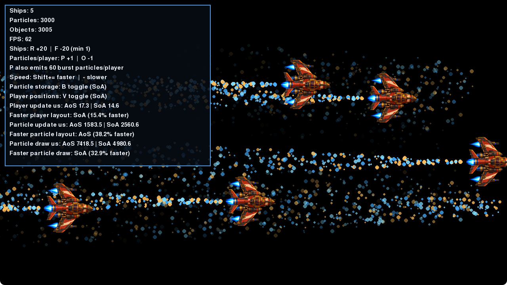

<p align="center">
  
</p>

<h1 align="center">Cache Raiders</h1>

<p align="center">
  
</p>

<p align="center">
  Thank you to the PyConKE organizers for the opportunity to share this project.
</p>

<p align="center">
  If you enjoy it, please share it widely and star the repository. It really helps more people discover the project.
</p>

Cache Raiders is a small Pygame CE demo for a live talk about two ways to
organize game data: one object per entity (array of structures, or AoS) and
one packed array per field (structure of arrays, or SoA).

The demo keeps the code paths visible and lets you switch layouts while the
game runs. It is intended to make the tradeoffs easy to discuss, not to serve
as a general-purpose game engine or a benchmark across all hardware.

## Run the demo

Requirements: Python 3.14 or later and [uv](https://docs.astral.sh/uv/).

```sh
uv sync
uv run cache-raiders
```

The rocket image is included as package data, so the installed command does
not depend on the directory from which you launch it.

## Controls

| Key | Action |
| --- | --- |
| `R` | Add 20 ships |
| `F` | Remove 20 ships, keeping at least one |
| `B` | Switch particle storage between AoS and SoA |
| `V` | Switch player-position storage between AoS and SoA |
| `P` | Add one particle per emission and emit a 60-particle burst per ship |
| `O` | Reduce particles per emission |
| `Shift` + `=` | Increase ship speed |
| `-` | Reduce ship speed |

The HUD shows live ship, particle, object, and frame-rate counts, along with
the selected storage modes.

## What the comparison shows

In AoS mode, particles are `Particle` objects and each player's position is a
`Vector2`. In SoA mode, particle fields and player position/speed fields live
in packed arrays. Each player continues to own its particle emitter.

Switching modes transfers live state, so particles and ships continue from
their current positions and ages. The HUD times player movement, particle
updates, and particle drawing separately. It reports rolling averages from the
latest 120 frames and names a faster layout after at least 30 samples for each
mode. Adding or removing ships resets both comparisons; changing particle
emission with `P` or `O` resets the particle comparisons. Keep the workload
steady while comparing. The HUD includes the percentage difference for each
measured winner.

For a more visible particle comparison, press `R` several times to add ships,
then press `P` a few times to increase continuous emission and create bursts.
Press `B` to switch particle layouts and compare the particle update and draw
timings after each mode has collected samples. The demo starts with only five
ships, so its initial workload may be too small to show a clear difference.
Overall FPS includes all drawing and is capped at 60, so use the microsecond
timings rather than FPS to compare layouts.

The SoA path still uses Python loops and scalar array reads and writes. Packed
arrays reduce storage overhead, but they do not automatically turn those loops
into vectorized machine code. With this intentionally simple implementation,
the two layouts can be close, and AoS can even win. The HUD reports the result
measured on the current workload rather than assuming SoA is faster.

## Build a package

```sh
uv build
```
