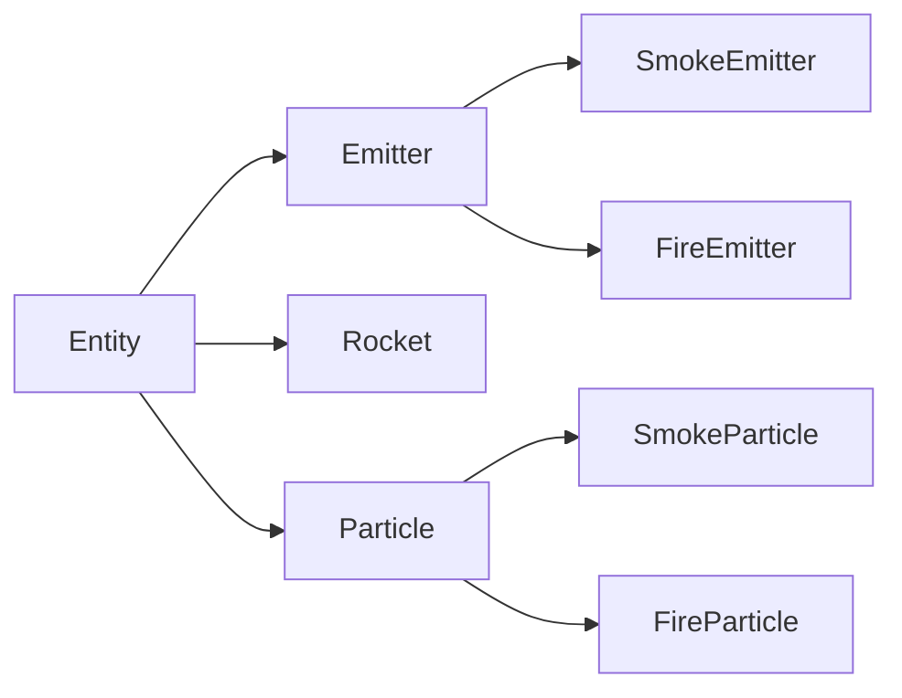

# Clean Architecture, Dirty Cache

## Data-oriented design

PyConKE

---

# About me

Im Erick Muuo,

Software Engineer, Video Games Enthusiast,

Currently working @Open Crafts Interactive

Github: github.com/iammuuo
Email: iam.muuo@proton.me

---

# Demo Time

---

# The shape of data shapes the work

- A game frame updates many entities, then draws them.
- Those systems ask different questions of the same data.
- Grouping data around those questions can change the cost of the work.

This demo compares two ways to store players and particles while the game runs.

---



---

Talk is cheap show the code man!

---


## Time for a refresher on memory

---


CPU -> RAM

But before the CPU can actually process there's a small `cache` l1 - l4

---


# Array of Structures (AoS)

Keep each entity's state together in an object:

```python
Player(position, speed)
Particle(position, velocity, age, lifetime, color, radius)
```

- Easy to model and follow one entity.
- Each particle owns its fields and drawing surface.
- A system may visit many objects and touch only a few fields on each.

---

# Structure of Arrays (SoA)

Keep one packed array for each field:

```text
players:   x[]  y[]  speed[]
particles: x[]  y[]  vx[]  vy[]  age[]  lifetime[]  radius[]  color[]
```

- Matching indexes describe the same entity.
- A system can scan the fields it needs in order.
- The demo uses Python's typed `array` storage, with Python loops over it.

---

# What the cache cares about

Processors move data between main memory and small, fast caches in chunks.
Sequential access can make more of each fetched chunk useful.

```text
AoS: [x y speed] [x y speed] [x y speed]
SoA: [x x x ...] [y y y ...] [speed speed speed ...]
```

When a system reads the same field for many entities, SoA can keep that field
close together. The benefit depends on the access pattern and the runtime.

---

# Keep the architecture visible

- Each player still owns its particle emitter.
- AoS and SoA can be switched while the game is running.
- Switching transfers live state, so entities keep their positions and ages.
- The HUD reports player movement, particle update, and particle draw time
  separately.

The demo stays small enough to discuss each path in a talk.

---

# The live comparison

Controls:

- `V`: switch player-position storage.
- `B`: switch particle storage.
- `R` / `F`: add or remove ships.
- `P` / `O`: increase or reduce particles per emission. `P` also emits a
  60-particle burst per ship.

The HUD averages up to 120 frames and waits for at least 30 samples per mode.
The loop targets 60 FPS, so compare the microsecond timings instead of FPS.

---

# One sample from the demo

Workload shown: **5 ships, 5,400 particles**. Lower time is faster.

| Work | AoS | SoA | HUD result |
| --- | ---: | ---: | --- |
| Player movement | 14.2 µs | 11.4 µs | SoA, 19.7% faster |
| Particle update | 1,816.9 µs | 4,470.0 µs | AoS, 59.4% faster |
| Particle draw | 8,095.0 µs | 8,450.9 µs | AoS, 4.2% faster |

These are readings from one machine and one workload, not universal rankings.

---

# Why SoA leads for player movement

- The AoS path calls `update_position` once per player.
- The SoA path makes one pass over the `x` and `speed` arrays.
- It avoids repeated per-player method dispatch and object-field access.

At five ships the absolute gap is only **2.8 µs**. The percentage looks larger
than the time saved, so treat this small-workload result cautiously.

---

# Why AoS leads for particle updates

The current SoA update packs surviving particles forward and copies all eight
fields for each survivor, including fields that did not change:

```text
x, y, vx, vy, age, lifetime, radius, color
```

The AoS path updates position and age, then filters dead particles. In this
implementation, that does less per-particle work than copying every column.

---

# Why particle drawing is nearly tied

Both paths still set alpha and call `blit` once per particle.

- AoS uses the particle's direct surface reference.
- SoA reads several arrays and looks up a cached sprite.
- The same per-particle drawing work dominates both paths.

AoS leads by about **356 µs**, or **4.2%**, in this sample. That is a small
difference and can shift with the workload and machine.

---

# What the result says

- A layout does not win every phase of a frame.
- The algorithm inside each layout matters as much as the layout.
- Packed arrays reduce storage overhead; Python still processes each scalar in
  these loops.
- This demo does not use a native or vectorized kernel that can process a whole
  column at once.

The benchmark measures these implementations, not an abstract AoS-versus-SoA
rule.

---

# A useful next experiment

- Keep the ship and particle counts steady while comparing.
- Switch modes and wait for both HUD readings to fill.
- Repeat the comparison; small differences can be timing noise.
- Try avoiding SoA copies when a particle stays at the same index.
- Measure update, draw, and memory use as separate questions.

---

# Takeaways

- Start from the work a system performs.
- Measure the hot path with a representative workload.
- Keep the clearest representation until measurements justify another one.
- Treat each result as evidence about this code, runtime, and machine.

## Clean architecture. Dirty cache. Measured trade-offs.
